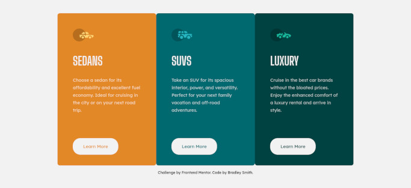

# Frontend Mentor - 3-column preview card component solution

This is a solution to the [3-column preview card component challenge on Frontend Mentor](https://www.frontendmentor.io/challenges/3column-preview-card-component-pH92eAR2-). Frontend Mentor challenges help you improve your coding skills by building realistic projects. This challenge in built using Vue.js 3, Sass, and Vite.

## Table of contents

- [Overview](#overview)
  - [The challenge](#the-challenge)
  - [Screenshot](#screenshot)
  - [Links](#links)
- [My process](#my-process)
  - [Built with](#built-with)
  - [What I learned](#what-i-learned)
  - [Continued development](#continued-development)
- [Author](#author)
- [Acknowledgments](#acknowledgments)

## Overview

### The challenge

Users should be able to:

- View the optimal layout depending on their device's screen size
- See hover states for interactive elements

### Screenshot



### Links

- Solution URL: [code via GitHub](https://github.com/bradleyhop/frontend-mentor-3-col-preview-card/tree/main)
- Live Site URL: [served via GitHub Pages](https://bradleyhop.github.io/frontend-mentor-3-col-preview-card/)

## My process

### Built with

- Semantic HTML5 markup
- CSS custom properties
- CSS Grid
- Mobile-first workflow
- [Vue.js](https://vuejs.org/) - JS Framework
- [Vite](https://vitejs.dev/) - Next Generation Frontend Tooling

### What I learned

While the layout is relatively simple, I chose to build this project in Vue to
help learn the new Composition API. In general, I found the new API in Vue 3 to
be easier to read and write since there's less syntaxical sugar around the
javascript code. I did, however, ran into a couple of challenges.

Vue now supports a `v-bind()` function that can be utilized to read props
and variables defined in the component's javascript. I utilized this feature
when passing the card's main color as a prop since that color is used in both
the background of the card, the color of the text in the button, and the
background color of the button on `:hover`. See: [v-bind() in css](https://vuejs.org/api/sfc-css-features.html#v-bind-in-css).

Another challenge I faced was getting images to load in Vite's build process.
Vite doesn't use Webpack, where Vue CLI did, and so I had to change my approach
when passing dynamic URL's. See: [Static Asset Handling](https://vitejs.dev/guide/assets.html).

For the assets to load both in Vite's development server and build, this is how
I solved it:
```javascript
const props = defineProps({
  icon: String // file name of images
  // ...etc
});

// icon location must be static, but can use template literals
const imgUrl = new URL(`../assets/images/${props.icon}`, import.meta.url).href;
```

In the styling:

```scss
$card-color: v-bind("style.cardColor");

.icon-img {
  // ...
  background-color: $color-card;
}
```


### Continued development

I plan on continuing my understanding of Vue's Composition API, CSS Grid, and in
general deepening my understanding of CSS.

## Author

- Website - [Bradley Smith](https://bradleysmith.tech)
- Frontend Mentor -
  [@bradleyhop](https://www.frontendmentor.io/profile/bradleyhop)

## Acknowledgments

I look forward to any feedback and encouragement that I might recive from the
Frontend Mentor community.

